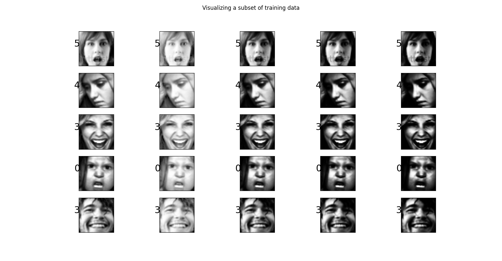
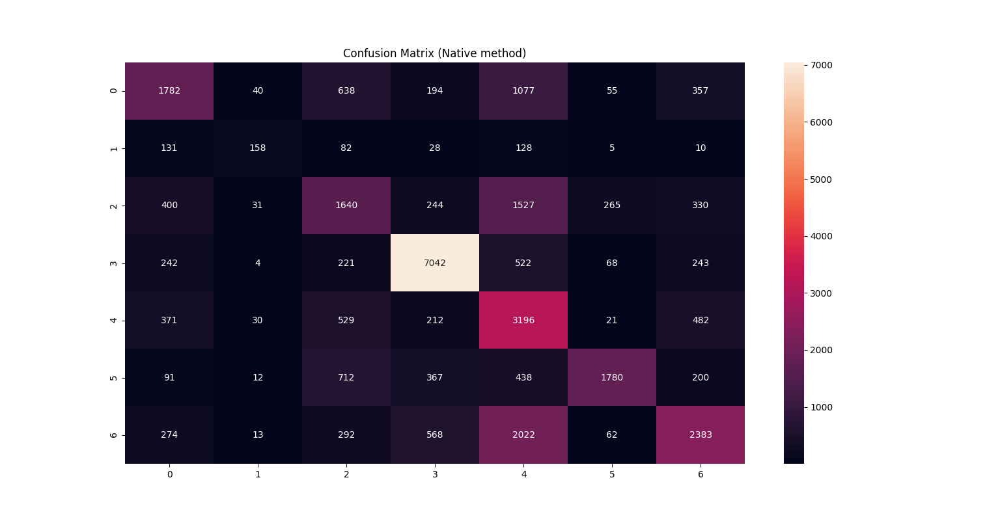
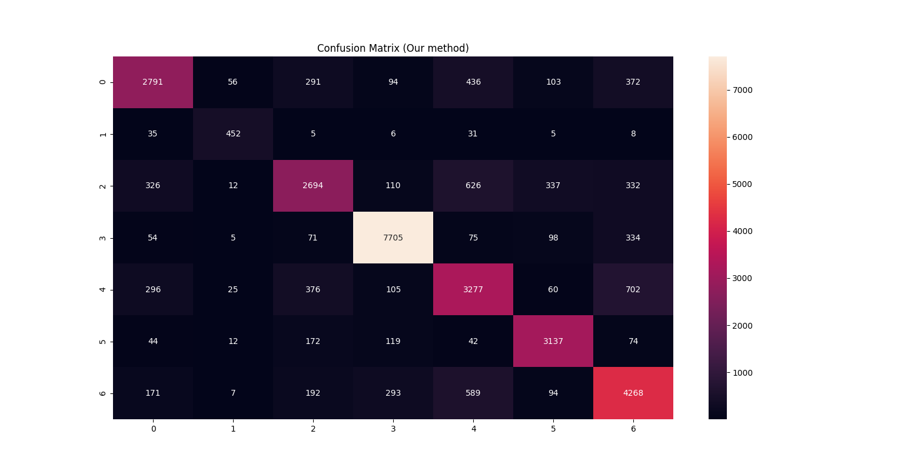

# Facial Emotion Recognition

## Digital Image Processing (DIP) Course Project

## Abstract
In this project, we have determined to solve challenges present in facial emotion recognition. We have chosen a deep learning implementation of emotion recognition model using mini xception architecture. These challenges are solved by employing extra preprocessing steps before training. We have demonstrated the improved accuracy of the model, before using our preprocessing techniques and after using the preprocessing techniques. Finally we conclude with the end results and the reasons for the increase in the accuracy.

## Problem statement
We were assigned to solve a challenge in the field of facial emotion recognition. In the field of facial emotion detection, the major challenges arise due to poor lighting conditions, variable facing directions, ethnic differences and cultural differences. We took on the challenge of improving the model’s accuracy by preprocessing the images based on the above problems, employing one solution for each issue. 

## Introduction
We searched what are all the problems still researchers are facing to solve in facial emotion recognition and selected some of them to solve as part of this project. Notably, lighting issues, face occlusion, racial differences and cultural differences. Our idea is to employ traditional image processing techniques and improve upon these edge cases present in the current facial emotion recognition methods. We aim to merge these techniques with the existing deep learning approach and increase their performance and accuracy.

## Dataset
* The dataset we have used is FER2013[3] which consists of 27000+ grayscale images of faces sized 48x48 pixels. There are seven emotions in the dataset, which are represented by their numeric labels (0=Angry, 1=Disgust, 2=Fear, 3=Happy, 4=Sad, 5=Surprise, 6=Neutral).
* Apart from this to add faces of different ethnicity and culture, the multi-cultural dataset was scraped from Google Images (American, African, Asian and Hispanic). These are labelled using pseudo labelling technique discussed further.



## Approach
Upon brainstorming for the possible solutions to the problems we have chosen to solve, we have winded upon the following preprocessing solutions. We decided to divide the preprocessing in five stages. The stages are as follows:
* **Lighting Issues**
	* Incorrect lighting on the faces while capturing images has always been a problem. So, in order to make a complete face to be in the same lighting condition, using histogram equalization a normalized lighting image can be produced.

* **Skin Tones Differences**
	* People from different countries have different skin colors. And since a model trained on specific skin color, encounters problems in detecting other skin colors. To overcome this, as the images being used for training are grayscale images, multiple images can be generated with different intensities levels which will depict the same as different skin colors in color images. All these different intensities generated images can be used for training, which could make the model forbid the skin color specific details.

* **Cultural Differences**
	* People from different cultures express their emotions differently. Inorder to make our model universal for multicultural people, datasets of people’s faces from different cultures can be used for training and make models learn cross cultural features and make it culture independent. For this data we scraped images from google and extract faces from the images. These images are then labelled using pseudo labelling.

* **Face Occlusion & Facial Features**
	* Detecting face and emotion upon wearing masks, glasses and other face covering materials is a difficult task. In some cases, where at least half of the face is visible, we can extract numerical face encodings from that and train the model on that encodings data. Moreover, face segmentation can also be used to extract only the face leaving out hair, background, etc.

* **Pseudo Labelling**
	* The multi cultural data we have scraped don't have emotion labels. So, to accompany that we employ pseudo labelling technique, where the unlabelled data will first be predicted by the trained model of labelled data and the predicted labels of unlabelled data will be used and the model is retrained.

## Procedure
First we train the model with the original dataset and observe the results, then we apply the above subtasks on each image in the dataset and produce variations in different dataset. The model is then trained again with the new obtained dataset and again the results are noted. At last we compare the results of the model on both the datasets and report our observations.

## To install the dependencies
```
pip install -r requirements.txt
```

## To run the model
```
python real_time_video.py
```

## To train the model
```
python train_emotion_classifier.py
```

## Results
We have trained both the models for 100 epochs using hyper parameters of batch size 32, patience for callback of 5 and a validation split of 20%. While training, Adam optimizer and categorical cross entropy is used.

| Model | Train Accuracy | Test Accuracy | F1 Score |
|    :----:   |    :----:   |    :----:   |    :----:   |
|Usual Preprocessing Model|70%|66%|0.5719|
|Our Custom Preprocessing Model|76%|75%|0.7703|

## Conclusion
In conclusion we can say, after analysing the results of both the models with custom preprocessing techniques, that the accuracy has improved than the original preprocessing techniques. Our preprocessing techniques normalize the data irrespective of light shades, skin color and variability by changing their contrast, intensity levels and trying to accommodate the ethnic and cultural differences. We got an increase of 9% in accuracy and 20% hike in F1 score.





## Team
* **Shaik Masihullah**
* **Shikhar Arya**
* **Kalyan Inguva**
* **Rithika Nenavath**

## Credits
* [Emotion Recognition](https://github.com/omar178/Emotion-recognition)